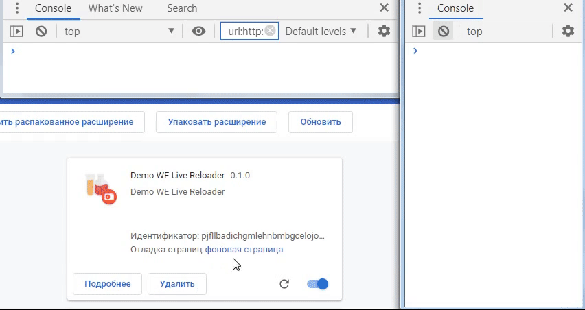
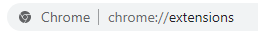
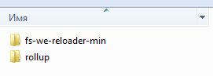
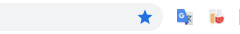
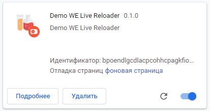
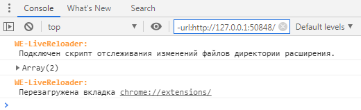
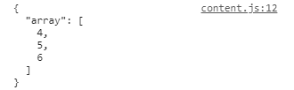
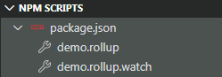

# WebExtension Live Reloader

<a target="target_blank" rel="noopener noreferrer" href="https://www.npmjs.com/package/we-live-reloader"></a>

<a target="_blank" rel="noopener noreferrer" href="./LICENSE.md"></a>

Перезагрузка расширения браузера `Chrome`, при изменении файлов каталога.  

* [Rollup Plugin](#rollup-plugin)
* [File System](#file-system)
* [Examples](#examples)
* [Options](#options)



>Все доступные модули используются только в `background.js` и вызывают `chrome.runtime.reload()`.
    
    npm i -D we-live-reloader
    // 2 в 1 (версия NPM не содержит примеров)
    import { rollupPluginWeReloader, fsWeReloader } from 'we-live-reloader'


## Rollup Plugin 

Использование с `npm i -D rollup`

```js
// rollup.config.js
import { rollupPluginWeReloader } from 'we-live-reloader'

// При использовании нескольких скриптов,
//   плагин необходимо вызвать до экспорта мульти-конфигурации
const WeReloader = rollupPluginWeReloader({ tabReload: true })

export default [
  {
    input: './background.js',
    output: {
      dir: 'webextension',
      format: 'iife'
    },
    // Основной плагин установим только для background.js.
    //   Плагин встраивает перезагрузчик в код
    plugins: [WeReloader]
  },
  {
    input: './content.js',
    // ...
    // Для остальных скриптов вызываем специальный метод,
    //   установится мини-плагин с вызовом перезагрузки без встраивания кода
    plugins: [WeReloader._parallelWatch()]
  }
]
```

Подробнее см. файл конфигурации _rollup.config.js_.


## File System

Перезагрузка используя API файловой системы. Никаких bundler-ов и серверов, просто добавьте файл к расширению. 

>Используйте этот модуль, когда нет необходимости собирать файлы и для простых примеров. Этот вариант использует постоянный опрос каталога расширения.

1. Вариант подключения отдельного файла:  
   Готовые файлы находятся в директории демо-примера _demo/fs-we-reloader_.
   Скопируйте файл _fs-we-reloader-tab.min.js_ или _fs-we-reloader.min.js_(без перезагрузки таба) в корневой каталог расширения и добавьте в манифест `"background": {"scripts": ["fs-we-reloader-tab.min.js"]}`. См. примеры.

2. Вариант самостоятельной сборки с установкой пользовательских параметров:  

```js
// Создайте новый файл фонового скрипта или импортируйте в любой имеющийся
import { fsWeReloader } from 'we-live-reloader'

// Можно оставить опции по умолчанию, или установить собственные
fsWeReloader({ readInterval: 1500, tabReload: true })

// ... далее что угодно
// Подключаем этот скрипт в манифест
```

Конфигурация сборки действующих примеров - _bundle.config.js_.


## Examples

Действующие примеры находятся в репозитории [https://github.com/AlexLonberg/we-live-reloader.git](https://github.com/AlexLonberg/we-live-reloader.git).

Установка демонстрационного расширения:

* В адресной строке перейти на _chrome://extensions/_  
  
  
  
* Активировать режим разработчика  
  
  

* Кликнуть на загрузку  
  
  

* Перейти к расположению каталога _.../we-live-reloader/demo_  
  
  

* Выбрать один из примеров. Повторить операцию для второго примера(одно лучше отключить). Отобразится значек расширения  
  
  

* Открыть фоновую страницу  
  
  

* В консоли фона появится оповещение, если это `fs-we-reloader` или при активном(npm run) плагине `rollup`   
  
  

* Открыть консоль для любой владки - примеры встраивают скрипт контента. Появится такой вывод   
  
  

### Использование примера rollup

В корне проекта выполнить команду:
    
    // установка зависимостей
    npm i
    // запуск rollup
    npm run demo.rollup.watch

В редакторе VSCode можно кликнуть на соответствующую команду:  



Плагин `rollup-plugin-we-reloader`(_.../rollup-plugin-we-reloader/index.js_) запустит сервер и установит свободный порт. В первый раз(и после каждого перезапуска `rollup`) обновите клавишей `F5` фоновую страницу, для возобновления подключения к серверу.

Зайдите в каталог примера с файлом  _demo-src/mod.js_ - этот файл импортируют оба скрипта: _demo-src/background.js_ и _demo-src/content.js_. При изменении переменных и сохранении кода, расширение обновится. Если оставить активной любую вкладку, расширение так-же обновит ее самостоятельно.

При использовании расширением нескольких скриптов, основной плагин `rollupPluginWeReloader` следует подключать только к одному _background.js_. Пример конфигурации в файле _rollup.config.js_.

### Использование примера fs-we-reloader

Никаких действий не требуется, скрипт расширения регулярно сканирует собственный каталог и проверяет последние модификации файлов. Обновляйте данные в файлах реального каталога расширения _demo/fs-we-reloader/data-background.js_ и _demo/fs-we-reloader/data-content.js_ и наблюдайте за консолью.

## Options

Использование пользовательских опций изменяет поведение перезагрузчика.

Все опции передаются объектом плагину `rollup-plugin-we-reloader` или при самостоятельной сборке `fs-we-reloader` статического файла.

```js
rollupPluginWeReloader({tabReload: true, ...})
```

* **readInterval=800:number** Интервал чтения каталога расширения.  
  Только для `fs-we-reloader`.  
  
* **delayReload=200:number** Задержка при обновлении.  
  Только для `rollup-plugin-we-reloader`.   
  Полезно, если сразу обновляются большое кол-во файлов и команда обновления может повториться.
  
* **tabReload=false:boolean** Перезагрузка активного таба.  
  По умолчанию `chrome.tabs.reload(tab.id)`, для текущего активного tab-а, не вызывается . Если расширение использует встраивание скриптов, установка этого параметра в `true`, будет вызывать `chrome.tabs.reload(tab.id)` после обновления `chrome.runtime.reload()` и только для текущего активного таба.
  
* **bypassCache=false:boolean** Обойти локальный веб-кеш.  
  См. [WebExtensions/API/tabs/reload](https://developer.mozilla.org/en-US/docs/Mozilla/Add-ons/WebExtensions/API/tabs/reload)

* **disconnect=300000:number** Только для `rollup-plugin-we-reloader`.   
  Когда сервер отключен, фоновый скрипт пытается переподключиться, что вызывает ошибку `GET http://127.0.0.1:62548/ net::ERR_CONNECTION_REFUSED`. После простоя соединения с интервалом `disconnect`, скрипт вызовет `EventSource.close()`. Дальнейшее обновление возможно принудительной перезагрузкой (клавиша `F5`).
  
* **port=0:number** Предпочтительный порт.  
  Только для `rollup-plugin-we-reloader`.   
  По умолчанию система выберет свободный порт и установит соединение `http://127.0.0.1:1234`.
  

Опций по умолчанию см. в файле корневого каталога _config.js_.

Дополнительно используются функции:

* **filter(path):boolean** Фильтр файлов.    
  Получает параметром строку пути к файлу. Фильтр должен вернуть булевый резальтат, при `false` изменение файла не вызовет перезагрузку.

```js
// Пример вызова обновления, только при изменении
//   файлов с расширением `.js` и только в каталоге `app`
const filter = (path) => (/\/?app\/[^/]+\.js$/i.test(path))
rollupPluginWeReloader({tabReload: true, filter, ...})
```


* **userReload():void** Собственный перезагрузчик.  
  При использовании собственного перезагрузчика вызов `chrome.runtime.reload()` игнорируется.

```js
// Изменяем поведение по умолчанию
const userReload = () => {
  // Делаем что-нибудь
  // ... 
  // в конце самостоятельно вызываем
  chrome.runtime.reload()
}
```
